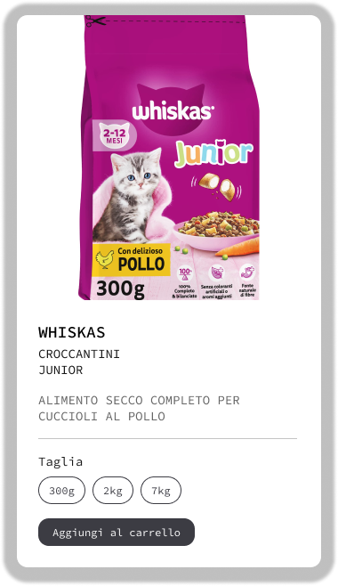

# 🐾 Figma Card in React

Una riproduzione fedele in React di una card progettata in Figma.  
Rappresenta una scheda prodotto per alimenti per gatti, con selezione della taglia e pulsante per l'aggiunta al carrello.

## ✨ Anteprima della Card



---

## 🧱 Tecnologie utilizzate

- React (Vite + Javascript)
- CSS
- Figma per la creazione dell'anteprima della card

---

## 🚀 Come avviare il progetto

Clona il repository ed esegui il progetto localmente:

```bash
git clone https://github.com/LindaTancini/webdesign-figma-card.git
cd webdesign-figma-card
npm install
npm run dev
```
